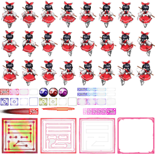
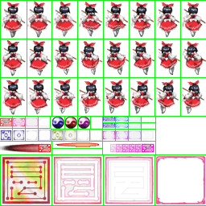

# 基本概念和指令

   * 引入面向对象编程和模块化程序设计与游戏资源管理的思想, 为后续的框架搭建打下基础;
   * 介绍 `PyGame` 中的数个基本概念: 窗口, 事件, 屏幕刷新, 资源管理, `Sprite` (精灵);
   * 介绍主窗口和 `Sprite` 的基本定义与使用方法, 解释利用 `subsurface` 实现贴图自动分割的方法;
   * 介绍 `Sprite` 的贴图变换与运动轨迹规划方法;


<br>

## 1. 面向对象编程

面向对象程序设计 (`Object-oriented Programming`), 是指具有 "对象" 概念的程序设计规范. 传统的, 面向过程的程序设计思想主张将计算机程序视为一系列函数的组合体, 或是一系列要对计算机下达的指令. 而面向对象程序设计的思想是, 将程序拆分为包含各种相互独立而又可以互相调用的对象, 并将函数和数据封装于对象中, 从而实现更好的软件灵活性, 扩展性和可维护性, 便于大型项目的开发. 

在面向对象的设计流程中, 以对象作为初始元素, 并将具有共同特征的对象归纳为 `类`, 进一步地组织不同的类之间的关系和等级. 

* 类<br>
  * "类" 定义了被描述事物的抽象特征, 包含了数据的形式和对数据的操作, 它可以为程序提供模板和结构. 程序在类中称为 "方法", 而数据和变量被称为 "属性". <br>
  * "对象" 是类的实例, 对象往往和现实事物相对应. 

  * "类" 可以被比它更加具体化的 "子类" 所继承.  "子类" 是 "父类" 的具象化或补充, 继承"父类" 的 "子类" 拥有父类所具备的一切属性和行为, 并且还包含了它自己的独有属性或行为. 


* 魔法方法<br>
  "魔法方法" 是 `Python` 中的内置方法. 绝大多数的魔法方法均对应一个内置函数或运算符. 这些函数或运算符在被使用在对象上时就会自动调用类中的对应魔法方法, 相当于重写了这些 `Python` 中的内置函数. 在此处暂时不做详细介绍.

<br>

## 2. PyGame: 


* 窗口和资源<br>
  `PyGame` 以窗口作为一切游戏内容的显示和互动区域, 要创建使用 `PyGame` 设计的游戏, 首先需要创建一个窗口. 

  ```
    # 定义屏幕属性: 分辨率设为640*480
    self.screen = pygame.display.set_mode([640, 480])
  ```

  "窗口" 可以被视为一个有边界的笛卡尔坐标系, 其原点 (0, 0) 位于屏幕的 **左上角**. <br>
  我们所创建的窗口是静态的. 对于窗口内显示的所有内容, `PyGame` 的屏幕帧对象 `Screen` 均会有这些内容的两个副本: `当前帧` 和 `下一帧`. 只有完成翻转 `Flip`, 才能实现帧与帧之间的切换. 屏幕的翻转可以由函数 `pygame.display.flip()` 手动控制, 这样使我们可以在两次屏幕帧刷新间隔内对其进行多次改动, 如完成对当前帧内自机, 自机弹, 敌机, 敌机弹等的位置和 HUD 显示数据等内容的改动后再从当前帧切换到下一帧, 而不是每次切换帧时都只能修改某一个对象的位置或信息, 从而让动画更加流畅, 提升帧速率. 

  因此, 我们可以在编写屏幕刷新函数时, 将翻转函数放在最后, 如下文所示: 
  ```
	def run(self):
		"""定义刷新函数"""
		while True:
	      --snip--
          
		    pygame.display.flip()       # 翻转当前帧, 应用屏幕变动
  ``` 
  
<br>

* 屏幕刷新<br>
  `Windows` 操作系统使用了事件驱动程序设计模型, 这一模型的程序运行流程由事件决定. 为了检测事件是否发生, 需要编写循环, 让事件驱动系统持续地监听是否发生事件, 我们称这样的循环为 `事件循环`. 在 `PyGame` 中, 为了实现游戏的信息更新和互动, 我们使用 `while` 来编写游戏的事件循环. 

  在每一个事件循环中, 屏幕均会刷新一次, 从而得到流畅的动画效果. 为了基于刷新率构建可控制自机子弹发射速度的计数变量 (计数器), 我们规定屏幕的最高刷新率为 `60 Hz`, 并在每个循环内更新时钟: 
  ```
    self.clock.tick_busy_loop(60)    # 定义帧速率为60, 更新时钟
  ```

<br>

* 事件识别和控制<br>
  在事件循环中, 我们使用事件处理器 `pygame.event`. 使用方法 `mygame.event.get()` 将从事件队列中返回所有可监听事件的状态列表. 利用事件监听, 我们可以获取几乎全部的用户输入信息, 从而实现对用户输入的响应. 

<br>

* Sprite<br>
  `Sprite`, 中文译为 "精灵", 是从面向早期计算机或游戏主机的游戏开发中流传而来的概念. 当时的计算机或主机图形性能极其有限, 无法高速渲染图片, 使得贴图无法被直接用于游戏开发. 为实现流畅的图形绘制, 这些设备上均搭载了可以高速绘制一些特殊编排的像素块的专有硬件, 开发者可以通过调用并组合这些像素块实现艺术字体和图形的绘制, 并可将它们作为游戏资源, 这些像素块就被称为 `Sprite`. 如今, 计算机的性能已足以高速绘制贴图, 无需再使用专有硬件配合 `Sprite` 组合成贴图的形状绕过硬件机能的限制, 但这一概念仍然广为流传并泛化. 现今, `Sprite` 一般用于指代一切应用于游戏中的贴图资源. 

  `PyGame` 使用 `SpriteClass` 和 `Group` 来定义和管理 `Sprite`, 并有数个函数用于检测不同 `Group` 内或组间的 `Sprite` 碰撞. 

  `Sprite` 资源是贴图, 在具有游戏资源管理器框架的项目 (比如本项目) 内, 需要先将它们导入并初始化才能被使用.  `PyGame` 支持多种图像格式, 包括 `jpg/jpeg`, `png`, `gif` 等. 我们使用函数: 

  ```
  pygame.image.load("文件名").convert_alpha()
  ```
  加载所需要的图片文件. 

<br>

* 贴图分割和动画效果 <br>
  每一张贴图资源的加载都需要一定时间. 为了减少加载时间, 我们往往会将许多的小尺寸贴图 (如不同的动画帧, 艺术字等) 按照一定的规律排布成一张尺寸较大的图片, 视其为 `SpriteSheet`, 导入游戏资源管理器中, 如下图: 

  <center> 
  
  
  
  </center>

  导入的 `SpriteSheet` 必须经过贴图分割后才能够被取用. 显见, 这张贴图的前三行可以被分割为数个长宽为 `(32, 48)` 的小矩形区域, 每个矩形区域都是自机移动动画的某一帧:

  <center>

  
  
  </center>

  我们使用 `subsurface` 方法对贴图进行分割. 语法如下: 
    
  ```
  分割出的子表面 = 贴图文件名.subsurface((
    从贴图x轴的该位置开始分割, 从贴图y轴的该位置开始分割, 分割出的子表面的宽, 分割出的子表面的高))
  ```

  以上图为例, 从该贴图的前三行分别分离出自机三种状态下的动画帧代码片段如下:

  ```
  tmp = Rect(0, 0, 32, 48)                      # 待分割的子表面初始位置
      tp = self.pic["player.png"]               # 加载贴图
      self.anime["player"] = [[], [], []] 	  # 待机 左行 右行
      for i in range(3):                        # 行数循环
        for j in range(8):                      # 列数循环
          self.anime["player"][i].append(tp.subsurface(tmp))
          tmp.left += 32                        # 读取下一帧
        tmp.top += 48                           # 换行
        tmp.left -= 256                         # 回到首列
  ```
  相应地, 我们可以设计并导入更多的 `SpriteSheet`. 
  实现某个对象地动画效果要求我们提供一个包含该对象动画全部帧的数据结构 (一般是列表或者元组), 在本项目中我们统一使用列表. 我们有三种方法构造存储动画帧的列表: 

  1. 分别存放动画每一帧的贴图文件, 并将其依次导入至列表中. 缺点是文件数量多, 加载时间长. 
  2. 将动画封装为 `Gif` 图片, 可以一次导入全部帧. 缺点是不支持高阶色深度帧, 图像效果差. 
  3. 使用 `SpriteSheet` 导入贴图并分割为各帧, 这也是本项目所采用的方法. 

  以上面的代码片段为例, 可见我们首先创建了一个以空列表为元素的空列表 `self.anime["player"]` , 并使用一个双层循环将三类, 每类 8 帧的动画帧分别导入至列表的三个元素中存储: 
  
  <center>
  
  
  
  </center>

  通过定义每一次刷新屏幕时将播放内容切换至下一帧, 并指定这样的循环在给定的列表中或者在给定的下标内进行, 可以实现动画效果: 

  ```
		# 一个随屏幕刷新自动切换动画帧的例子
    
      ---snip---
		if self.frame % 6 == 0:
			self.aindex += 1
		if self.aindex >= len(self.anime):
			if self.anime == canime["stay"]:
				self.aindex = 0
			else:
				self.aindex -= 4
      ---snip---
  
      ......

  	def draw(self, screen):
		"""定义屏幕绘制函数"""  
      ---snip---
		else:
			screen.blit(self.anime[self.aindex], self.rect)
      ---snip---
  ```

<br>

* 贴图变换和运动轨迹控制 <br>
  在上文中, 我们已经介绍了 `PyGame` 游戏框架中屏幕刷新和基于帧实现动画更新的原理. 要让 `Sprite` 在屏幕上真的 "运动" 起来, 我们需要为它编写一个在每一次事件循环中都可以改变其坐标的方法, 从而控制对象运动的轨迹.  
  
  在 `PyGame` 中, 我们可以通过规定直角坐标和旋转角度控制图像的位置和旋转.
  我们可以在设计 `Sprite` 类时使用命令: 
  ```
  self.point = [x, y]       # 定义坐标
  ``` 

  或者

  ```
  self.point[0]=point[0]    # x坐标
  self.point[1]=point[1]    # y坐标
  ```

  规定和更新其绝对坐标, 并使用下列命令:
  ```
  rotated_image = pygame.transform.rotate(image, degree)
  ```
  对图像作旋转变换 (`degree` 是 **逆时针** 旋转角度).  

  此外, 我们还可以调用 `PyGame` 内置的其他函数设定和调节图像透明度, 等比例缩放图像, 以 `x` 或 `y` 轴翻转图像, 反色指定区域, 以及在图像上设定遮罩. 这些对图像的进阶操作将在第三章内详细介绍.  

<br>

## 3. 模块化程序设计和资源管理思想

* 模块化程序设计 <br>
  在本项目中, 我们使用面向对象的程序设计思想, 将 `STG` 的各个组件模块化. 按照功能和模组的区分, 我们将程序分为数个模块, 并在各个模块中分别定义相关的类, 以及必要的方法. 在接下来的一章里, 我们将详细介绍基于功能划分和模块化思想所搭建的游戏整体框架, 并在第三章内充实各个模块的血肉. 

* 资源管理器 <br>
  为了充分调用和管理游戏所需要使用的资源, 我们在此引入游戏资源管理器的概念: <br>
  资源管理器使用程序内部的资源缓存和资源映射, 从而提高运行效率. 资源缓存 (`Cache`) 是通过缓冲区 (`Buffer`) 实现的. 缓冲区是一种数据结构特定的键-值对, 可以 $O(1)$ 的效率直接访问已加载的游戏资源. 在本项目中, 我们使用字典数据结构实现映射: 以需要加载的资源的文件路径为字典值, 以自定义的名称或代号为字典键. 通过该方法实现的资源管理器多用于贴图资源的管理. 在本项目中, 除了贴图资源, 音频资源和屏上敌机, 屏上子弹资源等均应用了资源管理器进行管理. 
  
<br>

在下一章中, 我们将搭建项目的基本逻辑框架, 并设计两个基本的游戏资源管理器: 游戏贴图资源管理器和游戏音频资源管理器. 