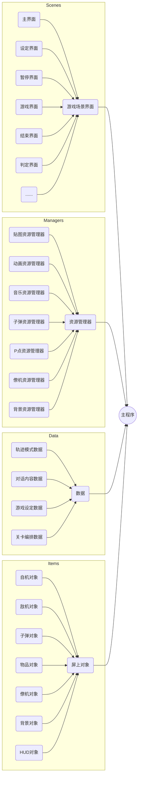

# 项目框架和资源管理

   * 搭建整体框架, 便于游戏的后续完善和开发; 
   * 设计和编写游戏主窗口 `Game_Window` 类, 实现窗口刷新等基础功能;
   * 搭建游戏贴图资源管理器, 导入并自动化分割 `Sprite` 贴图, 构成 `Animation` 或 `image` 格式化储存, 以备后续取用; 
   * 搭建游戏音频资源管理器, 导入并格式化储存音效和背景音乐, 以备后续取用.

<br>

## 1. 项目框架搭建

项目分为五个逻辑部分:主程序, 场景, 管理器, 数据和屏显对象:
1. 场景分类涵盖了游戏中所有场景界面. 
2. 管理器负责游戏运行过程中的全部资源管理, 包括贴图/音乐等静态资源, 以及在游戏过程中动态生成/刷新的弹幕, P点, 僚机和游戏背景的数据等动态资源. 
3. 数据分类包含了游戏所需要调用的静态数据, 包括全部的敌机/子弹的不同可能运动轨迹类, 游戏对话内容, 游戏设定数据和关卡编排数据.
4. 屏显对象包含了在进行游戏过程中, 屏幕内显示的动态对象, 包括自机/敌机, 僚机, 弹幕, P点, 动态背景, 以及指示当前点数, 剩余Player数, Bomb数等数据的HUD. 
   
逻辑结构的拓扑图如下所示: 

<center>


</center>

<br>

## 2. 设计和编写主窗口类

游戏主程序需要完成各类游戏数据的导入, 窗口的定义和初始化, 并启动事件循环. 在主程序中, 我们定义游戏主窗口类 `GameWindow`, 并设定静态属性, 定义窗口初始化方法和窗口刷新方法. 

注: 
1. `PyGame 2.0` 版本中, `pygame.display.set_mode` 函数中已不存在 `FULLSCREEN` 参数. 使用 `PyGame 1.9.6` 可实现游戏全屏运行.   
2. 此处展示的游戏窗口类函数并不完整, 缺少了场景 `Scene` 切换函数. 在本项目中, 我们使用界面栈实现场景的互相切换, 具体内容将在第三章介绍. 
   
```
class GameWindow(object):
	"""定义游戏窗口类"""

	def __init__(self):
		"""定义部分静态窗口属性"""
		# pygame.display.set_icon("")
		pygame.display.set_caption("迫真STG")
		self.screen = pygame.display.set_mode([640, 480])
		#self.screen = pygame.display.set_mode([640, 480], FULLSCREEN) 	# 全屏运行
		self.clock = pygame.time.Clock()
		# self.count = 0
		globe.high_score = 0

	def init(self):
		"""初始化函数"""
		pygame.init()							# 初始化游戏窗口
		pygame.mixer.init()						# 初始化混响器(音频支持)
		cache.cache_init()						# 初始化图像缓存
		self.rsmanager = Managers.resource.Resource()		# 定位贴图资源管理器
		self.msmanager = music.MusicManager()				# 定位音频管理器
		self.myfont=pygame.font.SysFont(None,20)			# 定义用于显示帧速率的字体
		self.goto(scene_title.SceneTitle)					# 该用法将在第三章介绍

	def run(self):
		"""定义刷新函数"""
		while True:
			self.scene.update()					# 刷新屏幕
			self.scene.draw(self.screen)		# 绘制屏幕
			self.clock.tick_busy_loop(60)  		# 定义帧速率为60, 更新时钟
			# 实时在屏幕右下角使用白色字体绘制当前帧速率
			fps_img = self.myfont.render(
				"fps:"+str(int(self.clock.get_fps()*100)*1.0/100), True, (255, 255, 255))
			fps_rect = fps_img.get_rect()
			fps_rect.bottomright = (640, 480)
			self.screen.blit(fps_img, fps_rect)

			pygame.display.flip()				# 翻转当前帧, 应用屏幕变动
```

<br>

## 3. 贴图资源管理器搭建

从第一章中, 我们已经了解了贴图导入命令和贴图分割的基本操作原理. 在搭建贴图资源管理器时, 由于需要导入的贴图数量很多 (如果游戏较为复杂的话数量超过数十张也是可能的), 我们建立一个文件名列表, 用一次循环导入列表中指定的全部文件. 

```
# -*- coding: UTF-8 -*-
import pygame
from pygame.locals import *

class Resource(object):
   """贴图资源管理器类, 维护全部的游戏贴图资源"""

	def __init__(self):
      # 储存需导入的文件名
		file_name = [
			"background.png",
			"bubble.png",
			"bullet1.png",
			"bullet2.png",
			"bullet3.png",
               ......
		]
		self.anime = {}
		self.image = {}
		self.pic = {}

		for i in file_name:
			self.pic[i] = pygame.image.load("GameResources\\pic\\"+i).convert_alpha()

      # 导入贴图并指定新代号, 预备后续处理
		self.image["background"] = self.pic["background.png"]
		self.image["loading"] = self.pic["loading.png"]
		self.image["quitb"] = self.pic["quitb.png"]
		self.image["quitd"] = self.pic["quitd.png"]
		self.image["startb"] = self.pic["startb.png"]
		self.image["startd"] = self.pic["startd.png"]
         ......
		self.pic["reimu.png"] = pygame.image.load(
         "GameResources\\pic\\reimu.png").convert()
		self.pic["reimu.png"].set_colorkey((0, 0, 0))
		self.image["reimu"] = self.pic["reimu.png"].subsurface(
         (0, 0, 128, 256))
		......

      # 分割并格式化储存贴图资源

		tmp = Rect(0, 0, 32, 32)
		tp = self.pic["resource.png"]
		self.image["resource"] = []
		for i in range(5):
			self.image["resource"].append([])
			for j in range(4):
				self.image["resource"][i].append(tp.subsurface(tmp))
				tmp.left += 32
			tmp.top += 32
			tmp.left -= 128
         ......


      # 分割并格式化储存动画资源

		self.anime["bubble"] = []
		tp = self.pic["bubble.png"]
		tmp = tp.get_rect()
		tmp.width /= 8
		tmpw = tmp.width
		for i in range(8):
			self.anime["bubble"].append(tp.subsurface(tmp))
			tmp.left += tmpw
         ......

```

<br>

## 4. 游戏音频资源管理器的搭建
类比于游戏贴图资源管理器的搭建, 我们可以相应地进行如下定义, 完成音频资源的导入和格式化: 

```
		self.se = {}
		se_name = [
			"se_bonus.wav",
			"se_cardget.wav",
         ......
		]

		se_myname = [
			"bonus",
			"cardget",
         ......
		]

		for i in range(len(se_name)):
			self.se[se_myname[i]] = pygame.mixer.Sound("GameResources\\se\\"+se_name[i])

```

在导入音频文件并将其格式化后, 我们还需要定义数个操控音频动作的方法, 如播放, 暂停, 终止, 音效播放类等. 代码实现如下: 

```
# -*- coding: UTF-8 -*-
import pygame
import globe

global se


class MusicManager(object):

	def __init__(self):
		global se
		se = globe.mgame.rsmanager.se

	def play_BGM(self,filename,volume=0.2):
		pygame.mixer.music.load(filename)
		pygame.mixer.music.set_volume(volume)
		pygame.mixer.music.play()

	def pause(self):
		pygame.mixer.music.pause()

	def unpause(self):
		pygame.mixer.music.unpause()

	def stop(self):
		pygame.mixer.music.stop()

	def play_SE(self, file, volume=0.1):
		global se
		se[file].set_volume(volume)
		se[file].play()

```

<br>

在下一章中, 我们将基于本章搭建的游戏框架和已导入的资源,设计自机, 敌机, 子弹, 轨迹类等模块, 完成页面, 功能和关卡设计.
