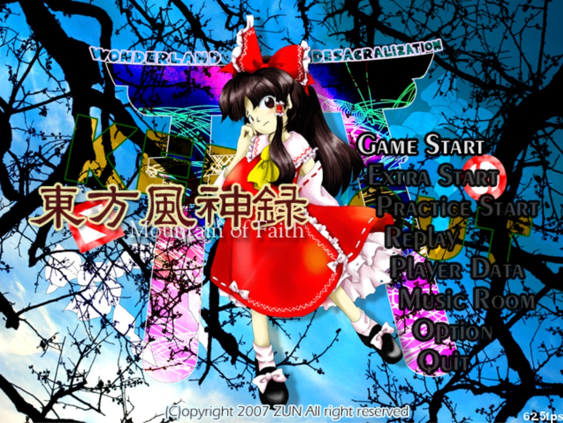

#  页面, 功能和关卡设计:

   * 设计游戏界面 `Scene`, 基于进出栈思想实现无需函数嵌套的界面平级切换;
   * 设计自机, 敌机和 `Boss` 类, 实现完美碰撞检测;
   * 设计子弹类 `Bullet` 和轨迹类 `Orbit`;
   * 设计并搭建示例关卡.


## 1. 设计游戏界面和界面切换系统


* 界面设计<br>
  本项目的界面类型分为静态 (Title, Menu, Pause, ScoreBoard, MusicRoom) 和动态 (Game) 两类. 由于时间所限, 暂时只完成了几个基本页面.

   静态页面主要由背景和选单组成, 图层复杂度低. 在本项目中, 菜单的选择和切换由事件检测实现, 选单和背景资源均以贴图形式导入至贴图资源管理器中并调用. 

   例: 主界面定义如下: 

   ```
   # -*- coding: UTF-8 -*-
   import pygame
   from pygame.locals import *
   import sys
   import globe
   from Scene import scene_loading


   class TitleMenu(object):
      """初始化菜单按钮, 设定菜单内容和淡出切换效果"""
      def __init__(self):
         """初始化主页面及按键"""
         self.button_rect = []  						# 获取按键的 'rect' 属性
         self.logo = (pygame.image.load("./Resources/pic/New/title/title_logo.png").convert_alpha()).subsurface(0,128,324,80)
         self.rs = globe.mgame.rsmanager.image		# rs = resource

         self.button_rect.append([400, 150])			# 定位 'Game_Start' 按键位置
         self.button_rect.append([410, 185])			# 定位 'Extra_Start' 按键位置
         self.button_rect.append([420, 220])			# 定位 'Practice Start' 按键位置
         self.button_rect.append([430, 255])			# 定位 'Replay' 按键位置
         self.button_rect.append([440, 290])			# 定位 'Player Data' 按键位置
         self.button_rect.append([450, 325])			# 定位 'Music Room' 按键位置
         self.button_rect.append([460, 360])			# 定位 'Option' 按键位置
         self.button_rect.append([470, 395])			# 定位 'Quit' 按键位置

         self.image = []				# 定义按键贴图, 以列表形式存储
         self.image.append(self.rs["Game_Startb"])			# 0
         self.image.append(self.rs["Game_Startd"])			# 1
         self.image.append(self.rs["Extra_Startb"])			# 2
         self.image.append(self.rs["Extra_Startd"])			# 3
         self.image.append(self.rs["Practise_Startb"])		# 4
         self.image.append(self.rs["Practise_Startd"])		# 5
         self.image.append(self.rs["Replayb"])				# 6
         self.image.append(self.rs["Replayd"])				# 7
         self.image.append(self.rs["Player_Datab"])			# 8
         self.image.append(self.rs["Player_Datad"])			# 9
         self.image.append(self.rs["Music_Roomb"])			# 10
         self.image.append(self.rs["Music_Roomd"])			# 11
         self.image.append(self.rs["Optionb"])				# 12
         self.image.append(self.rs["Optiond"])				# 13
         self.image.append(self.rs["Quitb"])					# 14
         self.image.append(self.rs["Quitd"])					# 15

         self.index = 0				# 初始化高亮按键: 默认为 'Start'
         self.choose = False			# 初始化按键选定状态
         self.flash = 0				# 初始化按键闪烁帧

         # 设定页面切换效果: 淡出
         self.fade = pygame.Surface(globe.mgame.screen.get_size())		# 设定遮罩尺寸
         self.fade.fill((0, 0, 0))		# 以纯黑色填充遮罩

      def event_control(self):
         """事件控制函数"""
         if not self.choose:
            for event in pygame.event.get():
               if event.type == pygame.QUIT:
                  pygame.quit()
                  sys.exit()
               if event.type == KEYDOWN:
                  if event.key == pygame.K_F4 and event.mod == pygame.KMOD_LALT:
                     pygame.quit()
                     sys.exit()
                  if event.key == K_UP:
                     if self.index != 0:
                        self.index -= 1
                        self.button_rect[self.index][0] -= 5				# 按键微移动画
                        self.button_rect[self.index + 1][0] += 5			# 按键微移动画
                        globe.mgame.msmanager.play_SE("select")
                  if event.key == K_DOWN:
                     if self.index != 7:
                        self.index += 1
                        self.button_rect[self.index][0] -= 5				# 按键微移动画
                        self.button_rect[self.index - 1][0] += 5			# 按键微移动画
                        globe.mgame.msmanager.play_SE("select")
                  if event.key == K_z:
                     self.choose = True
                     globe.mgame.msmanager.play_SE("select")
         else:				# 检测进行按键选择后的状态
            self.flash += 1
            if self.flash >= 20:				# 按键闪烁 20 下后进行页面切换
               if self.index == 0:
                  if self.flash >= 40:		# 按键闪烁 40 下后进行页面切换
                     globe.mgame.goto(scene_loading.Scene_Loading)
               if self.index == 1:
                  print("Extra_Start_Debug")
               if self.index == 2:
                  print("Practise_Start_Debug")
               if self.index == 3:
                  print("Replay_Debug")
               if self.index == 4:
                  print("Player_Data_Debug")
               if self.index == 5:
                  print("Music_Room_Debug")
               if self.index == 6:
                  print("Option_Debug")
               if self.index == 7:
                  pygame.quit()
                  sys.exit()

            if (self.flash % 2) == 0 and (self.flash <= 40):		# 控制按键闪烁效果
               tmp = self.image[self.index*2]
               self.image[self.index*2] = self.image[self.index*2+1]
               self.image[self.index*2+1] = tmp

      def draw(self, screen):
         """定义菜单绘制函数"""
         # 绘制 Logo
         screen.blit(self.logo, (32, 200))

         # 绘制屏幕按键
         for i in range(0, 8):
            screen.blit(self.image[2*i + 1], self.button_rect[i])
         screen.blit(self.image[2*self.index], self.button_rect[self.index])

         # 定义淡出效果遮罩循环
         if self.flash >= 20:
            self.fade.set_alpha((self.flash-20)*12)			# 对黑色遮罩进行透明化
            screen.blit(self.fade, (0, 0))					# 在屏幕上绘制半透明遮罩模拟淡出效果


   class Scene_Title(object):
      """定义主页面类"""
      # 去尼玛的驼峰命名法
      def __init__(self):
         """初始化主页面"""
         self.rs = globe.mgame.rsmanager
         self.menu = TitleMenu()
         self.count = 0
         self.fade = pygame.Surface(globe.mgame.screen.get_size())

      def update(self):
         """主页面屏幕更新函数"""
         self.menu.event_control()

      def draw(self, screen):
         """绘制背景"""
         screen.blit(self.rs.image["background"], (0, 0))
         self.menu.draw(screen)

         # 淡入效果
         if self.count <= 40:
            self.fade.set_alpha((255 - self.count * 12))  # 对黑色遮罩进行透明化
            screen.blit(self.fade, (0, 0))
            self.count += 1

   ```
  
  设计的主界面如下图: 
  
  <center>
  
  

   </center>
   

* 界面切换<br>
  常规的游戏界面切换方式是通过函数的嵌套调用实现的. 玩家每切换一次界面, 都是从当前函数调用一个新函数而 "切换" 到下一个界面的, 并没有跳出当前函数. 
  当切换了多个层级时, 函数之间的层层嵌套就会明显影响游戏运行速度. 在本项目中, 我们将游戏场景界面视为栈中存储的元素, 在启动游戏时自动地将最先调用
  的界面 (如 `Loading` 或 `Title`) 入栈, 而需要新界面时, 将新界面入栈, 并切换到新界面, 切换回原界面时则从栈中弹出新界面. 这样, 场景切换而导致的
  函数嵌套调用问题即可得到解决. 
  
  在 `GameWindow` 类中, 我们需要初始化界面栈: 
  
  ```
  self.stack = []									 # 定义界面栈, 防止scene函数重复调用
  ```
  
  同时需要在类中定义三个方法: 
  ```
  	def goto(self, scene):
		"""切换到 'scene'. 注意: 当且仅当游戏冷启动时可用该函数!"""
		self.scene = scene()
		self.scene.update()

	def call(self,scene):
		"""从当前界面切换到 'scene' """
		self.scene.stop()
		self.stack.append(self.scene)			# 新界面入栈
		self.scene = scene()					# 切换到新界面

	def back(self):
		"""切换回原界面"""
		self.scene = self.stack.pop()			# 原界面出栈
		self.scene.start()						# 切换回原界面  
  ```
  
<br>

## 2. 设计自机, 敌机和 `Boss` 类

